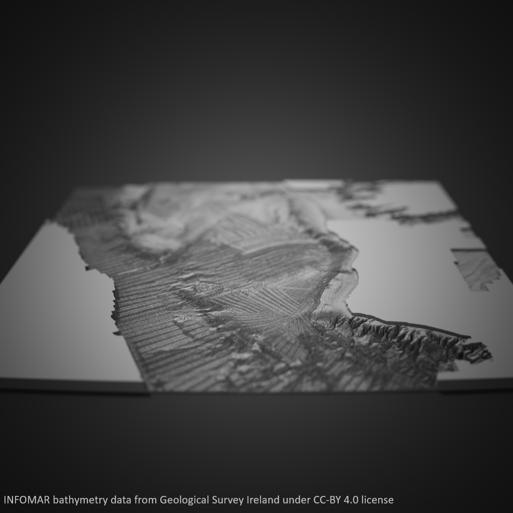

# 2021 30 Day Map Challenge
Details of maps created for the November 2021 [30 Day Map Challenge](https://github.com/tjukanovt/30DayMapChallenge).
 
## Day 1: Points
 
A map of the elctric vehicle charging points in and around Galway City. Tweet availabile [here](https://twitter.com/AdamLeadbetter/status/1455941591772778498).
 
- Data: OpenStreetMap, ESB
- Tool: [QGIS](https://www.qgis.org/en/site/)
 
## Day 2: Lines
 
All the roads on the island of Ireland. Tweet available [here](https://twitter.com/AdamLeadbetter/status/1455941843359784962).
 
- Data: OpenStreetMap
- Tool: QGIS
 
## Day 3: Polygons
 
UK Met Office Shipping Forecast sea areas. Tweet available [here](https://twitter.com/AdamLeadbetter/status/1455942637563822087).
 
- Data: Esri AGOL, General Bethymetric Chart of the Ocean
- Tool: QGIS
 
## Day 4: Hexagons
 
Mean sea surface temperature from the Argo drifiting float programme during October 2021. Tweet available [here](https://twitter.com/AdamLeadbetter/status/1456280744708411399).
 
- Data: [Argo drifiting float programme](http://www.ifremer.fr/erddap/tabledap/ArgoFloats.html)
- Tool: QGIS
 
## Day 5: Data Challenge 1: OpenStreetMap
 
Western States Endurance Run 100 mile course map. Tweet available [here](https://twitter.com/AdamLeadbetter/status/1456551004921647110).
 
- Data: OpenStreetMap, Western States website
- Tool: QGIS
 
## Day 6: Red
 
Fatal and injury road traffic collisions by county in Ireland. Tweet available [here](https://twitter.com/AdamLeadbetter/status/1456902855151992833).
 
- Data: Road Safety Authority (Ireland) - [data.gov.ie](https://data.gov.ie/dataset/roa27-traffic-collisions-and-casualities?package_type=dataset)
- Tool: QGIS
 
## Day 7: Green
 
Proximity of areas of Galway city to public transpot stops. Unshaded areas of the city are >1km from a bus or train stop. Tweet available [here](https://twitter.com/AdamLeadbetter/status/1457265476103557123).
 
- Data: OpenStreetMap
- Tool: QGIS
 
## Day 8: Blue
 
The distribution of turloughs (karst geomorphology lakes which dry out) in Ireland. Tweet available [here](https://twitter.com/AdamLeadbetter/status/1457797259626569736).

- Data: Geological Survey Ireland - [data.gov.ie](https://data.gov.ie/dataset/gsi-groundwater-karst-features?package_type=dataset)
- Tool: QGIS
 
## Day 9: Monochrome
 
London Marathon route. Tweet available [here](https://twitter.com/AdamLeadbetter/status/1457961043054014465).

- Data: OpenStreetMap, my own GPS trace from the 2016 London Marathon
- Tool: QGIS
 
## Day 10: Raster
 
INFOMAR seabed mapping survey data visualised in 3D.

- Data: Geological Survey Ireland - [data.gov.ie](https://data.gov.ie/dataset/infomar-bathymetry?package_type=dataset)
- Tool: [Aerialod](https://ephtracy.github.io/index.html?page=aerialod)
 
## Day 11: 3D

The Burren, Co. Clare, Ireland in a Minecraft style. Tweet available [here](https://twitter.com/AdamLeadbetter/status/1458698988362809348).

- Data: EU DEM v1.1, [Copernicus Land Service](https://land.copernicus.eu/imagery-in-situ/eu-dem/eu-dem-v1.1)
- Tool: Aerialod
 
## Day 12: Population
 
## Day 13: Data Challenge 2: Natural Earth
 
## Day 14: Map With a New Tool
 
## Day 15: Map Made Without a Computer
 
## Day 16: Urban/Rural
 
## Day 17: Land
 
## Day 18: Water
 
## Day 19: Island(s)
 
## Day 20: Movement
 
## Day 21: Elevation
 
## Day 22: Boundaries
 
## Day 23: Data Challenge 3: GHSL
 
## Day 24: Historical Map
 
## Day 25: Interactive Map
 
## Day 26: Chloropleth Map
 
## Day 27: Heatmap
 
## Day 28: The Earth is Not Flat
 
## Day 29: NULL
 
## Day 30: Metaapping Day
